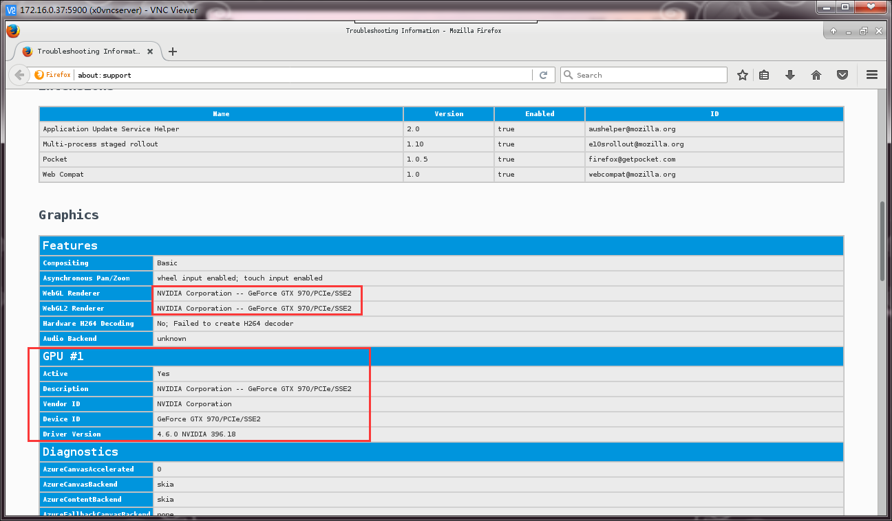
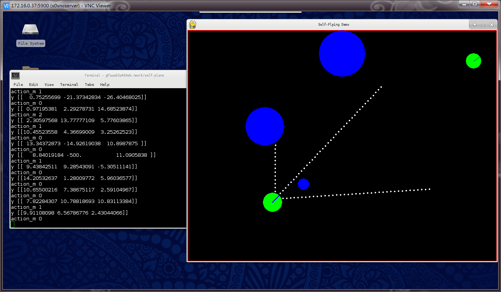

# centos-xfce4
run centos7   xfce4 desktop environment with nvidia-docker2 on kubernetes
X server is running inside docker , not host machine
#  default vnc password
```
123456
```
###firefox

###tensorflow with pygame3


# Requirements
    * [nvidia-docker2](https://github.com/NVIDIA/nvidia-docker)
    * install X11 server package (just install , RUN is not needed ) ,  xorg-x11-server-Xorg 
    * /dev/tty0
    * Nvidia display drvicer installed
    * host machine must be Centos7 (I guess maybe due to nvidia driver kernel module limit)

# Docker Env
    * VNC_PWD  x0vncserver auth password
# Tips
    * run ubuntu desktop when host machine is centos
        modify dockerfile and write install nvidia drvicer commands to avoid nvidia kernel module problem (I have tested unity7 but the images is very huge)
    * for test X11 server and Nvidia driver
        test commands are bottom in the Dockerfile
    * Run it
        check build.sh and run.sh

# Run in kubernetes with Nvidia GPU enabled
    here is a kubernetes device plugin required [k8s-tty-device](https://github.com/hakur/k8s-tty-device)

    after install [k8s-tty-device](https://github.com/hakur/k8s-tty-device) , run commands
    ```
    kubectl apply -f https://raw.githubusercontent.com/hakur/centos-xfce4/master/k8s.yml
    ```